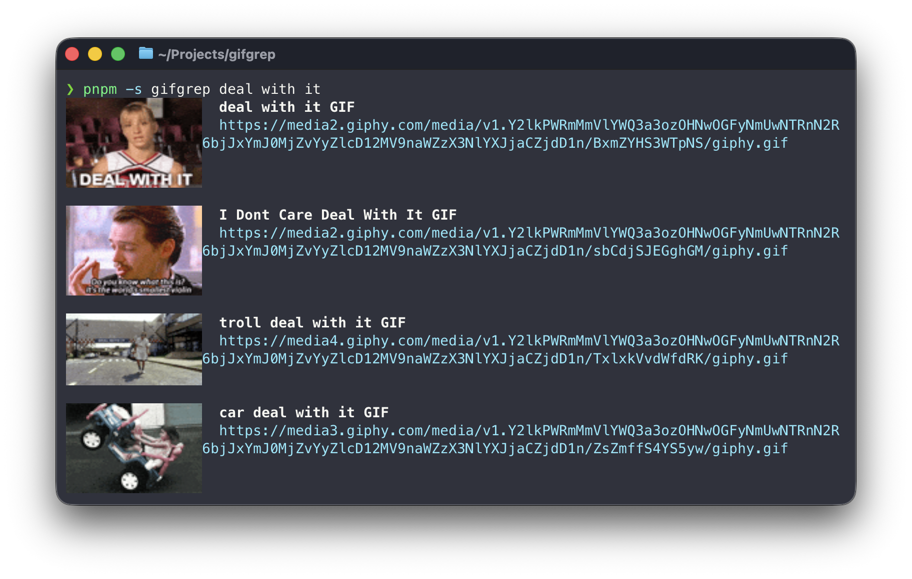

# 🧲 gifgrep — Grep the GIF. Stick the landing.

gifgrep searches GIF providers and gives you two fast paths: scriptable CLI output for pipes, and an interactive TUI with inline previews.

<table>
  <tr>
    <td width="50%">
      
      <br />
      <sub><b>TUI</b> (animated inline previews)</sub>
    </td>
    <td width="50%">
      
      <br />
      <sub><b>CLI</b> (pipeable output, optional still thumbs)</sub>
    </td>
  </tr>
</table>

CLI • TUI • Stills (PNG) • Kitty previews

Website: `https://gifgrep.com`

Homebrew (recommended):

```bash
brew install steipete/tap/gifgrep
```

Go install:

```bash
go install github.com/steipete/gifgrep/cmd/gifgrep@latest
```

## Features

- Scriptable search: readable plain output by default (TTY), plus `--format`, `--json`, `--max`, `--source`.
- Inline thumbnails in search output: `--thumbs` (Kitty graphics; TTY only; still frame).
- Download to `~/Downloads`: `--download` (CLI), `d` (TUI). Reveal with `--reveal` (CLI/TUI) or `f` (TUI).
- TUI browser: inline preview, quick download, reveal last download.
- Stills: `still` extracts one frame; `sheet` creates a PNG grid (`--frames`, `--cols`, `--padding`).
- Color + logging: `--color/--no-color`, `--quiet`, `--verbose`.
- Providers: `auto` (prefers Giphy when keyed), `tenor`, `giphy`.

## Quickstart

```bash
gifgrep cats --max 5
gifgrep cats --format url | head -n 5
gifgrep cats --download --max 1 --format url
gifgrep search --json cats | jq '.[0].url'
gifgrep tui "office handshake"

gifgrep still ./clip.gif --at 1.5s -o still.png
gifgrep sheet ./clip.gif --frames 9 --cols 3 -o sheet.png
```

## Providers

Select via `--source` (search + TUI):

- `auto` (default): picks Giphy when `GIPHY_API_KEY` is set, else Tenor.
- `tenor`: uses public demo key if `TENOR_API_KEY` is unset.
- `giphy`: requires `GIPHY_API_KEY`.

## CLI

```text
gifgrep [global flags] <query...>
gifgrep search [flags] <query...>
gifgrep tui [flags] [<query...>]
gifgrep still <gif> --at <time> [-o <file>|-]
gifgrep sheet <gif> [--frames <N>] [--cols <N>] [--padding <px>] [-o <file>|-]
```

## TUI vs CLI (and why previews differ)

- **CLI:** optimized for pipes. With `--thumbs`, it shows a *single still frame* inline (first decoded frame).
- **TUI:** interactive browser. Inline previews are *animated* (full frame sequence).
- Inline previews only work in **Kitty** or **Ghostty** (Kitty graphics protocol).

## How inline previews work (Kitty graphics protocol)

gifgrep decodes GIFs to PNG frames and streams them into the terminal via Kitty graphics escape sequences:

- Base64-encode PNG bytes and chunk them (4096 chars) into `ESC _G ... ESC \\` payloads.
- `a=T` uploads the base image; `a=f` appends animation frames (with per-frame delay).
- `a=a` sets animation timing / starts playback; `a=p` places the image in a cell rectangle.
- Old previews get cleaned up via `a=d` (delete by image id).

## JSON output

`--json` prints an array with: `id`, `title`, `url`, `preview_url`, `tags`, `width`, `height`.

## Environment

- `TENOR_API_KEY` (optional)
- `GIPHY_API_KEY` (required for `--source giphy`)
- `GIFGREP_SOFTWARE_ANIM=1` (force software animation)
- `GIFGREP_CELL_ASPECT=0.5` (tweak preview cell geometry)

## Test fixtures licensing

See `docs/gif-sources.md`.

## Development

```bash
go test ./...
go run ./cmd/gifgrep --help
```

Ghostty web snapshot:

```bash
pnpm install
pnpm snap
```

## GitHub Pages

Landing page lives in `docs/` (GitHub Pages -> `main` -> `/docs`).
