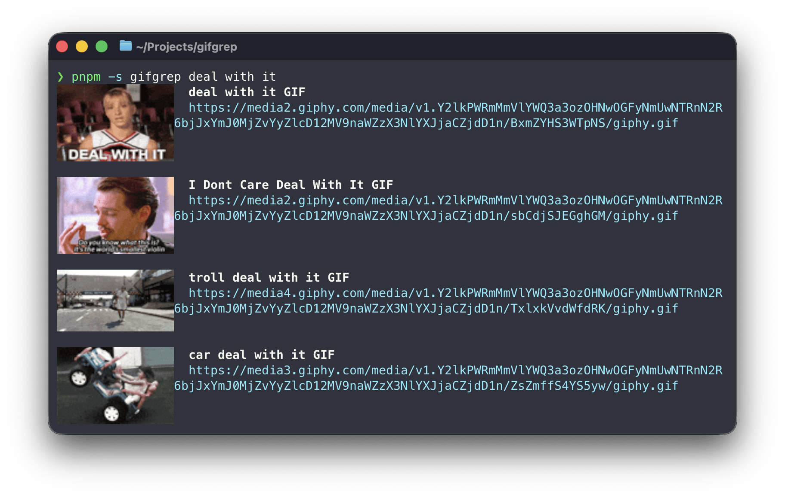

# gifgrep 🧲 — Grep the GIF. Stick the landing.

[](https://github.com/steipete/gifgrep/actions/workflows/ci.yml)
[](https://github.com/steipete/gifgrep/releases/latest)
[](https://go.dev/)
[](LICENSE)
[](https://github.com/steipete/homebrew-tap/blob/main/Formula/gifgrep.rb)
[](https://gifgrep.com)

gifgrep searches GIPHY and KLIPY from the terminal. It provides pipe-friendly CLI output and an interactive TUI with inline previews.

<table>
  <tr>
    <td width="50%">
      
      <br />
      <sub><b>TUI:</b> browse animated previews</sub>
    </td>
    <td width="50%">
      
      <br />
      <sub><b>CLI:</b> print results for people or pipes</sub>
    </td>
  </tr>
</table>

## Install

Homebrew is the shortest path on macOS and Linux:

```bash
brew install steipete/tap/gifgrep
```

With Go 1.25 or newer:

```bash
go install github.com/steipete/gifgrep/cmd/gifgrep@latest
```

Prebuilt macOS and Linux binaries are available from [GitHub Releases](https://github.com/steipete/gifgrep/releases/latest).

## Quick start

Set a provider key, then search or open the TUI:

```bash
export GIPHY_API_KEY="your-key"
gifgrep cats --max 3
gifgrep cats --format url | head -n 1
gifgrep tui "office handshake"
```

Use `KLIPY_API_KEY` instead to search KLIPY. With both keys configured, the default `auto` source tries GIPHY first and falls back to KLIPY if GIPHY fails.

## Commands

| Command | Purpose |
| --- | --- |
| [`gifgrep <query>`](https://gifgrep.com/search) | Search and print plain text, URLs, Markdown, TSV, or JSON. |
| [`gifgrep tui [query]`](https://gifgrep.com/tui) | Browse results with keyboard controls and inline previews. |
| [`gifgrep still <gif>`](https://gifgrep.com/still) | Extract one frame from a local or remote GIF as PNG. |
| [`gifgrep sheet <gif>`](https://gifgrep.com/sheet) | Create a PNG contact sheet from sampled frames. |

Run `gifgrep --help` or open the [command reference](https://gifgrep.com/commands) for the full flag set.

## Search and automation

Search output adapts to its destination: a terminal gets a readable list, while a pipe gets one URL per line. Select an explicit format when a script needs a fixed contract:

```bash
gifgrep cats --format url --max 5
gifgrep cats --json --max 5 | jq -r '.[].url'
```

`--download` saves results to `~/Downloads`; add `--reveal` to open the saved file in the platform file manager. The [search guide](https://gifgrep.com/search) covers formats and pipe recipes, and the [JSON reference](https://gifgrep.com/json) documents the structured result shape.

## Interactive browsing

`gifgrep tui` provides keyboard navigation, search editing, download, clipboard copy, and animated previews. Preview support depends on the terminal:

| Terminal | Preview path |
| --- | --- |
| Kitty, Ghostty | Kitty graphics protocol |
| iTerm2 | OSC 1337 inline images |
| Windows Terminal, WezTerm, Sixel terminals | Sixel |
| Truecolor terminals | ANSI half-block fallback when forced |

See [TUI controls](https://gifgrep.com/tui) and [inline preview behavior](https://gifgrep.com/previews) for protocol and configuration details.

## Local frame extraction

`still` and `sheet` work without a provider key:

```bash
gifgrep still clip.gif --at 1.5s -o still.png
gifgrep sheet clip.gif --frames 9 --cols 3 -o sheet.png
```

Both commands accept a local path or URL. Pass `-o -` to write PNG bytes to stdout.

## Providers and configuration

| Setting | Purpose |
| --- | --- |
| `GIPHY_API_KEY` | Search GIPHY directly or make it the preferred `auto` provider. |
| `KLIPY_API_KEY` | Search KLIPY directly and provide the `auto` fallback. |
| `GIFGREP_INLINE` | Override preview detection with `kitty`, `iterm`, `sixel`, `ansi`, or `none`. |
| `GIFGREP_SOFTWARE_ANIM` | Force or disable software-driven preview animation. |
| `GIFGREP_CELL_ASPECT` | Adjust inline preview cell geometry. |

Provider selection and fallback behavior are documented in the [provider guide](https://gifgrep.com/providers/).

## Development

```bash
make test
make check
make gifgrep -- --help
```

The generated GitHub Pages site lives in `docs/`. See [docs/development.md](docs/development.md) for the documentation and Ghostty snapshot workflows. Test GIF fixture sources and licenses are listed in [docs/gif-sources.md](docs/gif-sources.md).

## License

MIT. See [LICENSE](LICENSE).
