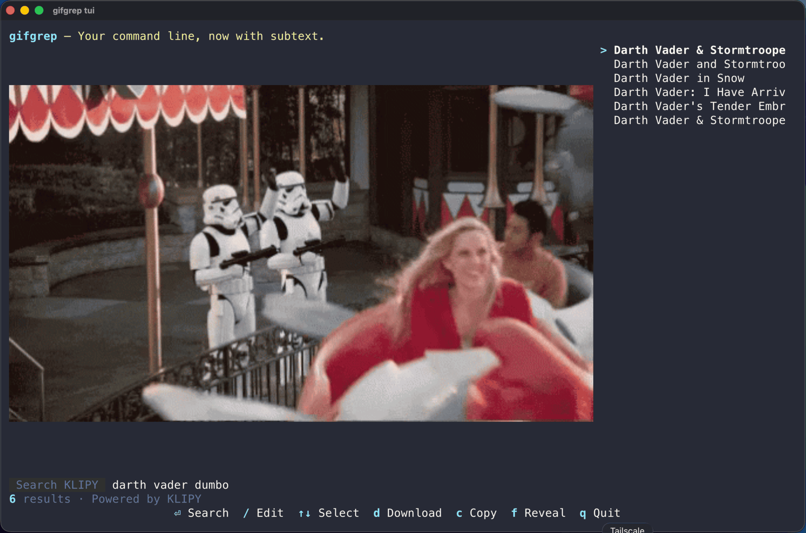

# `gifgrep tui`

The TUI is a small, opinionated terminal UI for browsing GIFs with **animated inline previews**.

```text
gifgrep tui [<query> ...] [flags]
```

```bash
gifgrep tui                    # launches with empty query, hit / to search
gifgrep tui cats               # initial query
gifgrep tui --source giphy cats
```



## Keys

| Key      | Action                                              |
|----------|-----------------------------------------------------|
| `/`      | Edit search query.                                  |
| `↑` `↓`  | Move selection.                                     |
| `d`      | Download current selection to `~/Downloads`.        |
| `c`      | Copy the selected GIF to the clipboard.              |
| `f`      | Reveal last download in Finder / Explorer / Files.  |
| `q`      | Quit.                                               |

On Linux, clipboard copy prefers `wl-copy` in Wayland sessions (`WAYLAND_DISPLAY` or `XDG_SESSION_TYPE=wayland`) and `xclip` otherwise. Install `wl-clipboard` for Wayland or `xclip` for X11; if the preferred tool is missing, gifgrep uses the other installed tool. macOS uses its built-in clipboard integration.

## Inline previews

The TUI streams animated previews using the [Kitty graphics protocol](previews.md#kitty-graphics) on Kitty/Ghostty, [OSC 1337](previews.md#iterm2-osc-1337) on iTerm2, Sixel where available, or a truecolor ANSI fallback when forced.

| Terminal       | Animation playback                                                    |
|----------------|-----------------------------------------------------------------------|
| Kitty          | Native. gifgrep uploads frames once; the terminal animates them.      |
| Ghostty        | Software playback (gifgrep ticks frames on a timer).                  |
| iTerm2         | Native — iTerm2 plays GIFs from raw bytes.                            |
| Sixel          | Software playback (gifgrep redraws frames into the same cell area).   |
| ANSI fallback  | Software playback with truecolor half-blocks.                         |
| Apple Terminal | Falls back to a static list (no graphics protocol).                   |
| tmux           | Best with a graphics-aware host terminal; YMMV with image passthrough.|

Force or disable software playback:

```bash
GIFGREP_SOFTWARE_ANIM=1 gifgrep tui cats   # always tick frames in software
GIFGREP_SOFTWARE_ANIM=0 gifgrep tui cats   # always trust terminal animation
```

## Tweaking preview geometry

Some terminals report cell sizes that make GIFs look squashed. Override the cell aspect ratio:

```bash
GIFGREP_CELL_ASPECT=0.5 gifgrep tui cats   # default
GIFGREP_CELL_ASPECT=0.45 gifgrep tui cats  # narrower
```

## Provider selection

Same `--source` as [`search`](search.md):

```bash
gifgrep tui --source giphy cats
gifgrep tui --source klipy cats
```

See [Providers](providers/) for the full matrix.

## When the TUI is the wrong tool

- For pipelines and scripts, use [`gifgrep search`](search.md). The TUI never writes to stdout.
- For local frame extraction, use [`still`](still.md) or [`sheet`](sheet.md). The TUI is search-first.
- In a non-interactive shell (CI, cron), the TUI will refuse to start. Use `search` with `--json`.
